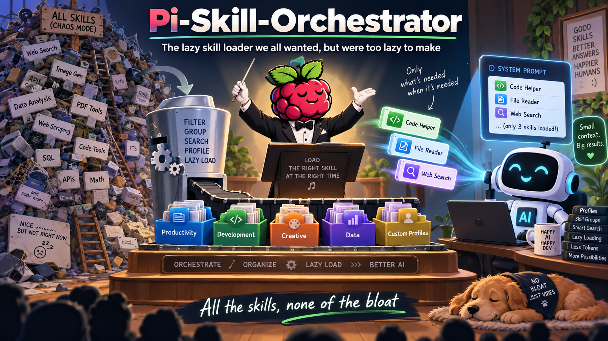

# Pi Skill Orchestrator

---

**Author/Developer:** [Alan Guice (Badgids)](https://github.com/badgids)  
**Copyright:** © 2026 Alan Guice (Badgids).  
**License:** [MIT License](LICENSE)  
**Version:** `0.1.26`

---



## The lazy skill loader we all wanted, but were too lazy to make

— All the skills, none of the bloat

Pi Skill Orchestrator is a Pi extension for people who use a lot of Agent Skills. It keeps Pi's normal skill autocomplete, but it stops the complete skill catalog from taking space in the LLM system prompt on every turn.

It adds lazy skill search, lazy skill loading, skill groups, reusable profiles, and recursive dependency loading. You can keep a large skill library installed without making the model read the whole catalog before it does any work.

Version `0.1.26` also adds an optional **Token Saver** for large tool results. It borrows proven ideas from [Headroom](https://github.com/headroomlabs-ai/headroom) and [RTK](https://github.com/rtk-ai/rtk), then applies them inside Pi without requiring either project.

> [!NOTE]
> Pi Skill Orchestrator is an independent community extension. It is not an official Pi project.

## Why this extension is needed

Pi already loads the full `SKILL.md` body only when a skill is used. That part is good.

The problem is the catalog that comes before the body. Pi normally adds every model-visible skill to the LLM system prompt. Each entry includes the skill name, description, and file location. That system prompt is part of the context sent to the model. A few skills are cheap. A large skill library is not.

In simplified form, Pi gives the model a catalog like this before the model chooses a skill:

```xml
<available_skills>
  <skill>
    <name>...</name>
    <description>...</description>
    <location>...</location>
  </skill>
  ...more installed skills...
</available_skills>
```

If you have 40, 60, or 100 skills installed, the model can receive dozens of descriptions and paths even when the task needs only one skill. That uses context for capabilities that may never be used in the current task.

```text
Normal Pi

installed skills
      |
      v
name + description + location
for every model-visible skill
      |
      v
LLM system prompt
      |
      v
context is used before a skill is needed
```

Pi Skill Orchestrator changes that flow.

```text
Pi + Skill Orchestrator

installed skills
      |
      v
metadata index outside model context
      |
      v
active profile or group
      |
      v
small system-prompt scope stub
      |
      v
skill_search when a skill is needed
      |
      v
only a few matching descriptions
      |
      v
skill loads one selected root
plus required dependencies
```

The extension removes Pi's native eager skill catalog before each model turn and replaces it with a small scope instruction. Installed skill names, descriptions, locations, and bodies stay out of the system prompt until they are needed.

Pi's `/skill:` autocomplete still works. Autocomplete is TUI data. It is not the LLM system prompt.

## Groups and profiles

Groups and profiles make a large skill library easier to use without turning the scope into a hard wall.

A **group** is a focused set of skills. You can make groups such as `Research`, `Documents`, `Planning`, `Debugging`, `Testing`, `Images`, or `Audio`. Use names that match the work you actually do. When a group is active, `skill_search` searches that group first. Activating the group does not load all of its skills and does not put all of their descriptions into the prompt.

A **profile** is a saved skill setup. A profile stores its own groups, memberships, dependency settings, and search-description limit. One Pi installation can therefore serve several kinds of work without mixing every skill into one search pool.

For example:

| Profile | Possible groups | Useful for |
| --- | --- | --- |
| `Daily Work` | Research, Writing, Documents, Planning | Research, reports, notes, summaries, and general assistant work. |
| `Software Development` | Planning, Debugging, Testing, Review, Release | Coding, maintenance, testing, and release work. |
| `Media Creation` | Writing, Images, Audio, Video, Publishing | Design, audio, video, and other creative work. |
| `System Administration` | Diagnostics, Linux, Networking, Containers, Deployment | Server and workstation maintenance. |

Groups and profiles are preferred search scopes, not prisons. If the active scope does not contain the capability the task needs, Skill Orchestrator can do a bounded global fallback search. Only the small fallback result set enters model context. The active group or profile stays selected.

Example:

```text
80 installed skills
      |
      v
Daily Work profile
      |
      v
Research group active
      |
      v
search Research first
      |
      +---- useful match ----> load one skill
      |
      +---- no good match ---> small global fallback
                                |
                                v
                          load one skill

Research remains the active group.
```

## Main features

- Keeps the complete installed skill catalog out of the LLM system prompt while the extension is active.
- Preserves Pi's normal `/skill:` autocomplete.
- Searches skill metadata only when the model needs a capability.
- Returns a small bounded set of matching skill names and descriptions.
- Loads one selected root skill at a time.
- Resolves recursive skill dependencies only when needed.
- Supports user-defined skill groups with optional short slash aliases.
- Supports reusable named profiles with separate groups and settings.
- Supports bounded global fallback when the active scope has no suitable skill.
- Respects Pi's `disable-model-invocation` behavior for model-driven discovery.
- Never edits third-party `SKILL.md` files.
- Never changes Pi's `settings.json` or `enableSkillCommands`.
- Uses atomic writes for its own profile and manager files.
- Adds an optional, profile-specific Token Saver for large tool results. It is off by default.
- Compresses JSON, search output, logs, tests, diffs, source reads, tables, config files, directory listings, and long plain text with content-aware rules.
- Keeps exact original tool output in a bounded in-memory recovery cache when content is compacted. Recovery IDs work only while that cache entry exists.
- Lets the model recover omitted lines with `token_retrieve` only when it needs them.
- Collapses exact repeated tool output instead of paying for the same content again.
- Uses local retrieval feedback to make future compression less aggressive for tool types that often need recovery.
- Keeps compression on the newest tool-result delta so earlier conversation content stays stable for provider prefix caching.
- Defers currently active non-core tool schemas behind `token_tool_search` and activates only a bounded matching set when needed.
- Shortens unusually long top-level tool descriptions while leaving parameter schemas and parameter descriptions exact.
- Leaves explicit machine-readable output such as `--json` unchanged.
- Protects source reads when the current task clearly requires exact code for editing or patching.
- Can reduce existing provider reasoning-effort fields after routine successful tool continuations. It never adds provider-specific fields.

## Optional Token Saver

Skill Orchestrator originally saved tokens by fixing the skill catalog. Large tool output is the next common source of context bloat. A test run can print hundreds of passing tests. A search can return the same pattern hundreds of times. A file read can load a large implementation when the model only needs its public structure.

Token Saver is **off by default**. Turn it on for the current profile with:

```text
/token-saver on
```

Or press `T` in the Skill Orchestrator manager. The setting belongs to the active profile, so a `Software Development` profile can use Token Saver while a different profile leaves tool output untouched.

When enabled, Skill Orchestrator works on tool results before the next model call:

```text
large tool result
      |
      v
content detector
      |
      +--> JSON arrays: keep boundaries, errors, relevant rows, outliers, state changes, and samples
      +--> search: group by file and cap repetitive matches
      +--> tests/logs: preserve failures and summaries, remove progress noise, collapse repeats
      +--> diffs: keep file/hunk headers and changed lines
      +--> source reads: keep imports, signatures, error handlers, and task-relevant lines
      +--> tables/config/text: keep structure, warnings, relevant lines, and representative samples
      |
      v
small result + recovery id
      |
      v
LLM

Need omitted detail?
      |
      v
token_retrieve(id, line range)
      |
      v
exact original text from local memory
```

The original is not written to disk by Token Saver. Recovery data is bounded and session-local. Recovery IDs do not survive Pi restart, reload, resume, new-session, or fork boundaries because Token Saver intentionally has no persistent recovery database. A compacted result can remain in Pi's saved transcript after its in-memory original is gone. If durable exact recovery across those boundaries is required, leave Token Saver off for that workflow. Compression fails open: if a transform cannot safely make the result smaller, the original result passes through unchanged. Skill bodies are never compacted because skill instructions must remain exact. Explicit machine-readable output passes through unchanged, and source reads stay exact when the current task clearly needs code for editing or patching.

Token Saver also applies the lazy-loading idea to tools. Non-core active tool schemas can move behind `token_tool_search`. Only a few matching tools are activated when the model actually needs them. Very long top-level tool descriptions can be shortened at the provider boundary, but parameter schemas and parameter descriptions are left alone.

This design combines Headroom-style content routing, reversible retrieval, lazy tool-schema loading, tool-description compaction, cache-friendly live-delta compression, adaptive recall feedback, verbosity steering, and clamp-only effort routing with RTK-style filtering, grouping, truncation, deduplication, failure focus, tree compression, structure-only views, progress filtering, machine-readable passthrough, and token-savings accounting. The implementation is original to Skill Orchestrator; it does not copy either project or require their runtimes.

Some upstream features do not map safely to Pi's public extension API. Skill Orchestrator does not fake full-response semantic caching, provider-managed cache objects, guessed cold-prefix rewrites, cross-agent persistent semantic memory, external Serena installation, instruction-file learning, or hidden ML compression. The detailed [Token Saver guide](docs/token-saver.md) explains each boundary and why it is left out.

Commands:

```text
/token-saver              # toggle
/token-saver on
/token-saver off
/token-saver status
/token-saver stats
/token-saver clear        # clear session recovery/cache/stats; keep on/off setting
```

Read [Token Saver](docs/token-saver.md) for the complete design, tactics, safety rules, and Headroom/RTK mapping.

## Table of contents

- [Why this extension is needed](#why-this-extension-is-needed)
- [Groups and profiles](#groups-and-profiles)
- [Main features](#main-features)
- [Optional Token Saver](#optional-token-saver)
- [Requirements](#requirements)
- [Install](#install)
- [Quick start](#quick-start)
- [Commands](#commands)
- [Manager controls](#manager-controls)
- [How lazy search works](#how-lazy-search-works)
- [Configuration files](#configuration-files)
- [Compatibility](#compatibility)
- [Documentation](#documentation)
  - [Documentation index](docs/README.md)
  - [Installation guide](docs/installation.md)
  - [Usage guide](docs/usage.md)
  - [Groups and profiles](docs/groups-and-profiles.md)
  - [Token Saver](docs/token-saver.md)
  - [Command reference](docs/commands.md)
  - [Configuration reference](docs/configuration.md)
  - [Architecture and context model](docs/architecture.md)
  - [Dependency loading](docs/dependencies.md)
  - [Pi compatibility](docs/compatibility.md)
  - [Troubleshooting](docs/troubleshooting.md)
  - [Development and testing](docs/development.md)
  - [Publishing to npm and GitHub](docs/publishing.md)
- [Testing and development](#testing-and-development)
- [Contributing](#contributing)
- [Security](#security)
- [Release history](#release-history)
- [License](#license)

## Requirements

- [Pi](https://github.com/earendil-works/pi).
- Node.js `22.19.0` or newer.
- A terminal that can run Pi.

Check your versions:

```bash
pi --version
node --version
```

## Install

### Install from npm

After the package is published:

```bash
pi install npm:pi-skill-orchestrator
```

Restart Pi or run:

```text
/reload
```

### Install from GitHub

```bash
pi install https://github.com/badgids/pi-skill-orchestrator.git
```

For only the current project:

```bash
pi install -l https://github.com/badgids/pi-skill-orchestrator.git
```

### Test a local checkout without installing it

From the repository root:

```bash
pi -e ./src/index.ts
```

See the [installation guide](docs/installation.md) for update and uninstall instructions.

## Quick start

Open the manager:

```text
/skill
```

Create a group with `N`. Add skills with `Space`. Press `Enter` on the group to make it the active search scope.

Create a profile with `P` when you want a separate saved setup.

You can also load one exact skill directly:

```text
/skill:skill-name
```

Or activate a group and send a task in one command:

```text
/skill:Research compare these sources and summarize the differences
```

## Commands

| Command | Purpose |
| --- | --- |
| `/skill` | Open the Skill Orchestrator manager. |
| `/skill-manager` | Open the same manager. |
| `/skill-profile` | Open the saved-profile selector. |
| `/skill-profile:<Profile_Name>` | Switch directly to one saved profile. |
| `/skill-config` | Show the manager and active-profile file paths. |
| `/token-saver [on|off|status|stats|clear]` | Toggle, inspect, or clear the optional tool-output Token Saver. |
| `/skill:<Skill_Name> [task]` | Load one exact skill and its recursive dependencies. |
| `/skill:<Group_Name>` | Activate one group as the preferred lazy-search scope. |
| `/skill:<Group_Name> <task>` | Activate one group and send a task. |
| `/<Group_Name>` | Optional short alias for group activation. |
| `/<Group_Name> <task>` | Optional short alias plus a task. |
| `/<Group_Name>:<skill> [task]` | Load one explicit group member and its dependencies. |

The canonical direct profile-switch syntax uses a colon:

```text
/skill-profile:Profile_Name
```

`/skill-profile Profile_Name` is not the direct-switch syntax.

See the [command reference](docs/commands.md) for details.

## Manager controls

| Key | Action |
| --- | --- |
| `Tab` | Switch between Groups and Skills. |
| Arrow keys | Move through the current list. |
| `Enter` | Activate a group or load the selected skill. |
| `Space` | Add or remove the selected skill from the selected group. |
| `A` | Edit autoload dependencies for the selected skill. |
| `N` | Create a group. |
| `R` | Edit the selected group. |
| `D` | Delete the selected group after confirmation. |
| `/` | Search installed skills by name or description. |
| `T` | Toggle Token Saver for the active profile. |
| `P` | Create a new profile. |
| `L` | Open the saved-profile selector. |
| `?` | Open help. |
| `Esc` | Close the current view. |

Changes are autosaved. There is no separate save command.

## How lazy search works

The model-facing `skill_search` tool searches the active scope first. It returns at most a small set of matching metadata. The model then calls `skill` with one exact name.

If the active scope has no match, Skill Orchestrator can search outside it. Only skills returned by that fallback search become eligible as outside-scope model-selected roots. Switching groups or profiles clears that fallback authorization.

Dependencies are different from roots. A selected root can depend on skills outside the active group or profile. Those dependencies load recursively without changing the active scope.

Read [Architecture and context model](docs/architecture.md) and [Dependency loading](docs/dependencies.md) for the full rules.

## Configuration files

Skill Orchestrator stores only its own configuration.

Manager manifest:

```text
~/.pi/agent/skill-manager.json
```

Profiles:

```text
~/.pi/agent/skill-profiles/<profile-id>.json
```

It does not use Pi's global settings file as storage. The Token Saver on/off flag is stored inside the active Skill Orchestrator profile.

Read the [configuration reference](docs/configuration.md) before hand-editing these files.

## Compatibility

Version `0.1.26` is verified against Pi `0.85.1`. It was also audited against Pi upstream `main` on 2026-09-15 at commit `60e7e76bd7ea25cad1dd6f3f1ce0d18814a42759`.

The package uses Pi's documented public package roots and declares Pi-provided modules as peer dependencies with `"*"`. This lets the running Pi installation supply the matching core modules.

A scheduled GitHub Actions workflow checks the extension against the latest published Pi packages. A future Pi release can still introduce a breaking API change, so a green compatibility workflow is evidence, not a permanent promise.

See [Pi compatibility](docs/compatibility.md).

## Documentation

Every project document is linked from the [Table of contents](#table-of-contents). The [documentation index](docs/README.md) gives a second map of the detailed guides.

Start with:

- [Installation](docs/installation.md) for install, update, and uninstall steps.
- [Usage](docs/usage.md) for normal workflows and manager controls.
- [Groups and profiles](docs/groups-and-profiles.md) for organizing large skill libraries.
- [Architecture](docs/architecture.md) for the system-prompt and lazy-loading design.
- [Token Saver](docs/token-saver.md) for optional tool-output compression and reversible recovery.
- [Troubleshooting](docs/troubleshooting.md) for common problems.
- [Publishing](docs/publishing.md) for GitHub and npm release steps.

## Testing and development

Run the complete local check:

```bash
npm run check
```

Check the npm package contents:

```bash
npm run pack:check
```

Run both before a release:

```bash
npm run release:check
```

Test the real extension in Pi:

```bash
pi -e ./src/index.ts
```

See [Development and testing](docs/development.md).

## Contributing

Focused bug reports, tests, documentation fixes, and pull requests are welcome. Keep changes narrow and preserve the zero-eager-catalog design.

Read [CONTRIBUTING.md](CONTRIBUTING.md) before opening a pull request.

## Security

Pi extensions run with the current user's permissions. Review extension code before installation.

Pi Skill Orchestrator does not make network requests, spawn shell commands, edit third-party skill files, or change Pi's global settings. It reads installed skill metadata and reads skill bodies when loading skills or resolving dependency information. When Token Saver is enabled, exact originals of compacted tool results are kept only in a bounded in-memory session cache for reversible recovery.

Read [SECURITY.md](SECURITY.md) for reporting guidance.

## Release history

See [CHANGELOG.md](CHANGELOG.md).

## License

Pi Skill Orchestrator is released under the MIT License. See [LICENSE](LICENSE).

Copyright © 2026 Alan Guice (Badgids).
